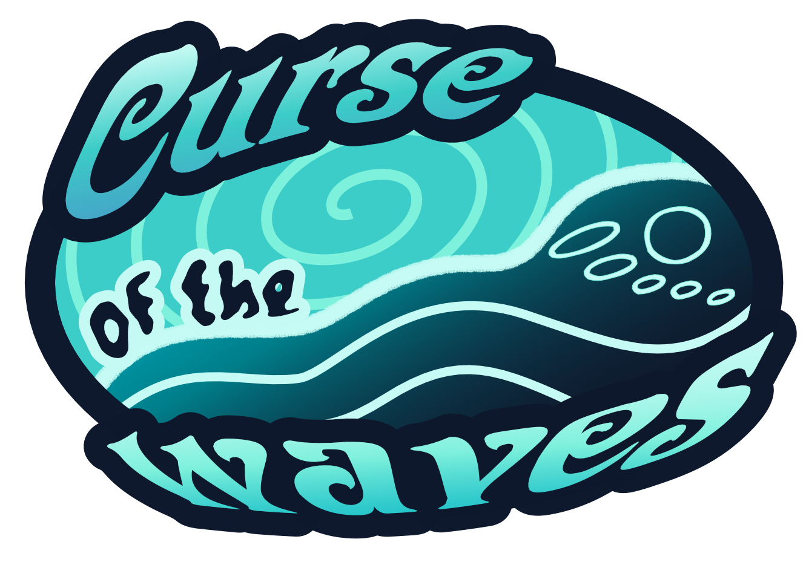
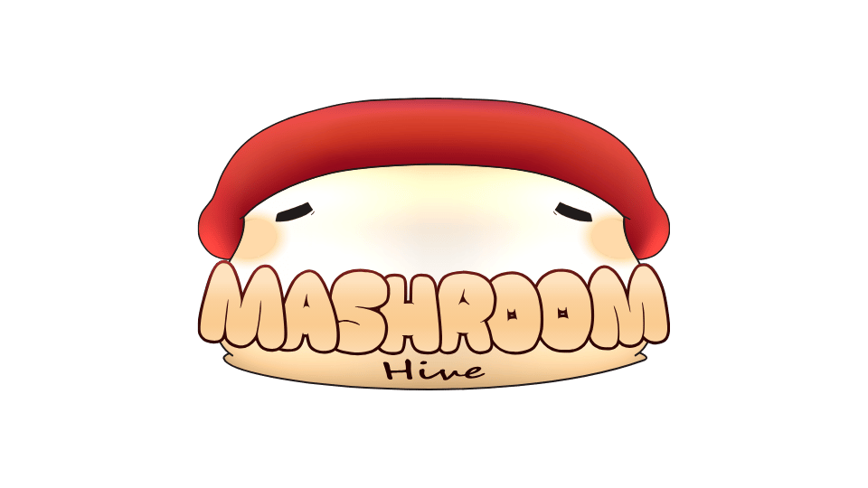

> ¡También en español!: [README_es.md](README_es.md)

  

## Description

> Submission for [GitHub's GameOff 2025](https://itch.io/jam/game-off-2025)

Curse of the Waves puts you in the shoes of Zachary, a college student who uses surfing as a way to distract himself. But things don't go as planned, and suddenly you find yourself underwater with something (someone?) talking to you. Dive in, choose your words carefully, and try to return to your life as it always has been.

### Controls

This game has both keyboard/mouse and controller options

By default they are as follows, they can be changed on settings

- **Up**: W / Left stick up
- **Down**: S / Left stick down
- **Left**: A / Left stick left
- **Right**: D / Left stick right
- **Action**: E / Xbox A / PlayStation X / Nintendo B

### Surf minigame

Use the Left and Right controls to evade the obstacles

### Dialogs

Click or use the action to advance and do the selected action.

### Cave minigame

Hide from the waves by pressing the action button and move with the other controls, the waves announce themselves with sound! Reach the end and beware of the minions!

## Table of contents

- [Description](#description)
  - [Controls](#controls)
  - [Surf minigame](#surf-minigame)
  - [Dialogs](#dialogs)
  - [Cave minigame](#cave-minigame)
- [Table of contents](#table-of-contents)
- [License](#license)
- [Additional Licenses](#additional-licenses)
- [Credits](#credits)
- [Made with](#made-with)
- [Contact us](#contact-us)

## License

This project is licensed under the MIT - see the [LICENSE](LICENSE) file for details.

## Additional Licenses

This project uses third-party assets whose licenses can be found in the following files and links:

- Dialogic addon - [License](curse-of-the-waves/addons/dialogic/LICENSE)
- Pixabay audio - [License](https://pixabay.com/es/service/license-summary/)
  - **Night Paradise (Instrumental)** by Alex_MakeMusic - [Source](https://pixabay.com/es/music/optimista-night-paradise-instrumental-269040/)
  - **Tense Cinematic Trailer** by Tunetank (AI) - [Source](https://pixabay.com/es/music/escena-de-terror-tense-cinematic-trailer-347631/)
  - **Tension Dark CInematic** by NikitaKondrashev - [Source](https://pixabay.com/es/music/construir-escenas-tension-dark-cinematic-254405/)
  - **Scary Horror Music** by SoundGalleryByDmitryTaras - [Source](https://pixabay.com/es/music/melod%c3%adas-de-miedo-para-ni%c3%b1os-scary-horror-music-118577/)
  - **Panic Attack** by geoffharvey - [Source](https://pixabay.com/es/music/escena-del-crimen-panic-attack-427789/)
  - **Light of the Void. Mystical Orchestral background music for video** by White_Records - [Source](https://pixabay.com/es/music/late-light-of-the-void-mystical-orchestral-background-music-for-video-348318/)
  - **More Locks than Doors** by Tim_Kulig_Free_Music - [Source](https://pixabay.com/es/music/electr%c3%b3nico-more-locks-than-doors-360854/)
  - **Splash Effect** by Universfield - [Source](https://pixabay.com/es/sound-effects/splash-effect-229315/)
  - **Body fall** by thekids15 - [Source](https://pixabay.com/es/sound-effects/body-fall-195147/)
  - **Winter Wind** by DRAGON-STUDIOS - [Source](https://pixabay.com/es/sound-effects/winter-wind-402331/)
  - **Extraterrestrial Alert Sound** by FNX_Sound - [Source](https://pixabay.com/es/sound-effects/extraterrestrial-alert-sound-287337/)
- **Ukelele Instumental Beat** by Zero a la izquierda beats - [Source](https://www.youtube.com/watch?v=pel4xECbv2o)

## Credits

- **Lola Cáceres Fernández** - Design
- **Manuel Amaya Orozco** - Art & Narrative
- **Cristina Morgado Núñez** - Audio
- **David López Carrasco** - Programming
- **Santiago García Guzmán** - Programming
- **Paula Rumeu Romero** - Production

Special thanks to our teachers, classmates, friends, and family for their support and feedback, to GitHub for organizing GameOff 2025, to the Godot Engine community for their incredible resources and help, and to the authors of the third-party resources used in this project.

## Made with

-  - Code Hosting
-  - CI/CD
-  - Game Distribution
-  - Game Engine
-  - Code Editor
- , [MediBang Paint](https://medibangpaint.com/en/), [Procreate](https://procreate.art/) - Graphic Design Software
-  - Audio Editing Software
-  - File Sharing and Collaboration

## Contact us

  

- Email: <mashroom.hive@gmail.com>
- Issues: [GitHub Issues](https://github.com/IES-Rafael-Alberti/gameoff2025-Mashroom/issues)

---

  Made with ❤️ by <a href="https://github.com/salem404">@salem404</a>

