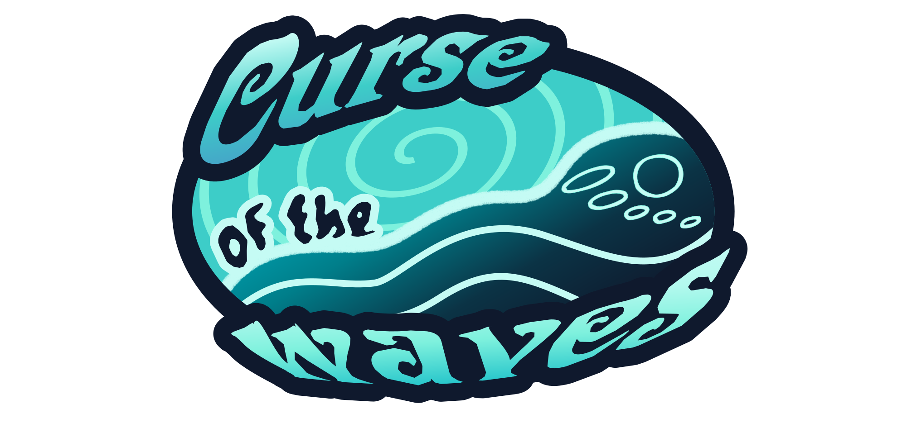

  

## Description

A narrative adventure game made with Godot Engine.

> Submission for [GitHub's GameOff 2025](https://itch.io/jam/game-off-2025)

## Table of contents

- [Description](#description)
- [Table of contents](#table-of-contents)
- [License](#license)
- [Additional Licenses](#additional-licenses)
- [Contact us](#contact-us)

## License

This project is licensed under the MIT - see the [LICENSE](LICENSE) file for details.

## Additional Licenses

This project uses third-party assets whose licenses can be found in the following files and links:

- Dialogic addon - [License](curse-of-the-waves/addons/dialogic/LICENSE)
- Pixabay audio - [License](https://pixabay.com/es/service/license-summary/)
  - **Night Paradise (Instrumental)** by Alex_MakeMusic - [Source](https://pixabay.com/es/music/optimista-night-paradise-instrumental-269040/)
  - **Tense Cinematic Trailer** by Tunetank (AI) - [Source](https://pixabay.com/es/music/escena-de-terror-tense-cinematic-trailer-347631/)
  - **Tension Dark CInematic** by NikitaKondrashev - [Source](https://pixabay.com/es/music/construir-escenas-tension-dark-cinematic-254405/)
  - **Scary Horror Music** by SoundGalleryByDmitryTaras - [Source](https://pixabay.com/es/music/melod%c3%adas-de-miedo-para-ni%c3%b1os-scary-horror-music-118577/)
  - **Panic Attack** by geoffharvey - [Source](https://pixabay.com/es/music/escena-del-crimen-panic-attack-427789/)
  - **Light of the Void. Mystical Orchestral background music for video** by White_Records - [Source](https://pixabay.com/es/music/late-light-of-the-void-mystical-orchestral-background-music-for-video-348318/)
  - **More Locks than Doors** by Tim_Kulig_Free_Music - [Source](https://pixabay.com/es/music/electr%c3%b3nico-more-locks-than-doors-360854/)
  - **Splash Effect** by Universfield - [Source](https://pixabay.com/es/sound-effects/splash-effect-229315/)
- **Ukelele Instumental Beat** by Zero a la izquierda beats - [Source](https://www.youtube.com/watch?v=pel4xECbv2o)

## Contact us

  

- Email: <mashroom.hive@gmail.com>
- Issues: [GitHub Issues](https://github.com/IES-Rafael-Alberti/gameoff2025-Mashroom/issues)

---

  Made with ❤️ by <a href="https://github.com/salem404">@salem404</a>

